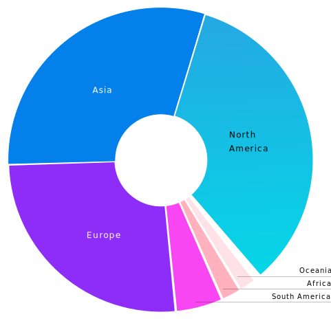

= Open Source Software in the Social Sector

== Introduction

[NOTE,caption=Quick Read]
====
* This report is based on research undertaken by the GitHub Social Impact team and the Case Foundation
on the barriers and opportunities of open source software (OSS) in the social sector.
* It includes practical steps the social sector can take to increase its adoption of OSS,
the benefits of more strongly integrating the social sector in the open source ecosystem,
and actionable recommendations for funders, producers, and consumers of OSS in the social sector.
====

The monetary and functional value of open source software (OSS) has spurred its exponential growth.
In 2019, GitHub, the global leader in OSS hosting, had 2.5+ million open source contributors,
which is a more than five-fold increase since 2014.
The majority of these open source contributors came from outside of the United States,
with notable project and contributor growth in Nigeria, Kenya, Indonesia, Pakistan, and Turkey, among others.
As digital technology plays an increasingly central role in major industries such as healthcare, finance, retail, and civil services,
adoption of OSS and open source concepts are becoming more common in commercial private sector and government technology.

.Total open source contributors

In this paper, the "`social sector`" is defined as non-governmental
organizations that have a primary purpose to actively advance or
positively contribute to any pressing societal issue or challenge.
International (global) development, disaster risk management and
humanitarian response, public health, and human rights are major
industries that comprise the social sector.

While there are U.S. domestic and international organizations that
focus almost exclusively on technology for social good, most of
the social sector focuses primarily on programmatic work that
directly touches beneficiaries or clients.
The importance placed on using technology best practices, tools,
and methods--both to support programmatic work and general operations--therefore
varies widely in the social sector.
As this paper will cover, *OSS is one such set of technologies that could be better utilized*.

A recent report conducted by Devex, a leading global development media outlet,
found that 86 percent of their survey respondents,
"`believe that the technology, skills and approaches [international] development professionals
use in 10 years will be significantly different than they are today.`"
Indeed, research conducted for this paper found a high demand of social sector
professionals who want to strengthen and diversify their technology capacity.
Building off these ideas, this paper will demonstrate that:

[IMPORTANT]
====
If the social sector does not actively and continuously
consider open source, it may miss opportunities to adopt
technology solutions that best strengthen its programmatic
and operational work.
====
