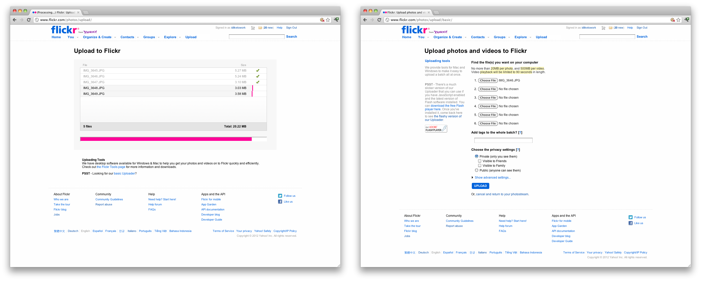

:chapter-number: 1
:chapterId: chapter-01
:sourceDir: ./examples
:nodeCurrentVersion: v10
:npmCurrentVersion: v6
:npmModulesCount: 782{nbsp}000
:nodeContributorsCount: 2{nbsp}000
:sectnums:
:revdate: {docdate}
:imagesdir: {indir}
ifdef::env[]
:imagesdir: .
endif::[]

= Histoire, écosystème et gouvernance

include::../docs/web-header.adoc[]

Faisons le point sur ce qu'est Node pour mieux comprendre les discussions qui
animent la communauté et d'où vient cette plate-forme qui fait tant parler d'elle.

====
.Sommaire
- Bref historique
- Les raisons du succès
- Pourquoi éviter Node
- Pourquoi choisir Node
- L'écosystème des acteurs
- Gouvernance du projet
====

[abstract]
--
Node.js est-il un langage de programmation ?
Node.js est-il un framework JavaScript ?
Qu'en restera-t-il une fois la frénésie retombée ?

Ce chapitre permet de *comprendre pourquoi Node a émergé* et comment.
Surtout, il vous permettra de comprendre les choix techniques
à l'origine des fondations de Node et ce que l'utiliser
peut vous apporter, que ce soit dans un contexte personnel ou professionnel.
--

== Node.js : un environnement d'exécution JavaScript

Node.js n'est pas un langage de programmation.
Ce n'est pas non plus un framework JavaScript.
*Node.js est un environnement d'exécution JavaScript*.

La différence entre ces trois désignations peut sembler subtile, futile voire
inutile, mais le terme "environnement" est la véritable nature de Node.

Exécuter du JavaScript côté serveur n'est pas une révolution.
Netscape Enterprise Server s'y est déjà essayé au début des années 1990,
juste après son introduction dans le navigateur web Netscape Navigator.

En 1997, la société Netscape s'est attelée à créer Rhino
([URL]#https://www.mozilla.org/rhino/#), un environnement d'exécution JavaScript
tournant sous Java disponible sous licence libre.
C'était un des projets liés à la réécriture de Netscape Navigator en Java.
Si la société a depuis fermé ses portes, _Rhino_ a entraîné l'émergence de projets
utiles aux développeurs{nbsp}web.

Entre-temps, le langage JavaScript évolue, le Web{nbsp}2.0 émerge des cendres de la
première bulle Internet et d'autres initiatives voient le jour dans les années 2000
comme APE (_Ajax Push Engine_, [URL]#http://ape-project.org/#).
Elles mettent également en œuvre JavaScript côté serveur.
JavaScript était surtout un choix logique de partage de code entre client et
serveur pour Comet, le précurseur des <<../chapter-09/index.adoc#websockets,WebSockets>>.

[TIP]
.[RemarquePreTitre]#Glossaire# Comet
====
Comet est un terme regroupant les différentes tentatives techniques permettant
à un serveur web d'envoyer des données à un client sans que celui-ci ne les ait
demandées initialement.

Parmi ces techniques, on retrouve le _long polling_, consistant à conserver une
connexion Ajax ouverte pendant la durée de vie d'une page web.
====

[TIP]
.[RemarquePreTitre]#Glossaire# WebSockets
====
WebSockets est un protocole basé sur{nbsp}TCP.

Il maintient une connexion HTTP active entre un client et un serveur et y fait
transiter les données de manière bidirectionnelle.

Ce protocole sera probablement rendu obsolète par HTTP/2, le successeur de HTTP/1.1.
HTTP/2 a été lancé par Google sous le nom de protocole SPDY (prononcer _speedy_).
====

[TIP]
.Cas d'utilisation modernes de Rhino
====
Rhino est toujours utile dès qu'un projet Java implique du JavaScript.

Google l'utilise comme environnement d'exécution de ses https://gsuite-developers.googleblog.com/2012/11/using-open-source-libraries-in-apps.html[Apps Scripts].
Ces scripts sont destinés à développer des extensions et des interactions
supplémentaires pour les documents Google{nbsp}Drive.

Rhino est également employé dans YUI Compressor ([URL]#https://yui.github.io/yuicompressor/#),
un optimiseur CSS et JavaScript créé par Yahoo,
désormais surpassé par Closure Compiler ([URL]#https://developers.google.com/closure/compiler/#)
et UglifyJS ([URL]#https://npmjs.com/uglify-js#).
Ce dernier est écrit en JavaScript et repose sur Node.
La boucle est bouclée.
====

Node représente un *environnement d'exécution* (_runtime_), un
*ensemble d'API JavaScript* ainsi qu'une *machine virtuelle{nbsp}(VM) JavaScript*
performante (parseur, interpréteur et compilateur) capable d'accéder à des ressources
système telles que des fichiers (_filesystem_) ou des connexions réseau (_sockets_).

Typiquement, une personne développant en Node écrit du code se basant sur les
API à disposition.
Ce code est lu par le _runtime_ Node, qui le transmet à la{nbsp}VM JavaScript.
Enfin, cette dernière traduit le programme en langage machine (_bytecode_)
avant que le programme soit effectivement exécuté par le processeur.

Pour comprendre comment Node a opté pour cette approche, retournons en 2009,
lorsque son créateur Ryan{nbsp}Dahl cherche à résoudre élégamment un problème de
performance de programmation.

== Bref historique

En 2006, Ryan{nbsp}Dahl est un étudiant américain en troisième année de doctorat
de mathématiques.
Son but initial était de devenir professeur dans cette matière, mais il prend la
décision de ne pas terminer sa thèse et d'entreprendre un voyage au{nbsp}Chili.

Alors qu'il cherche à effectuer des petits boulots, il y rencontre une autre
personne développant des sites web.
Ruby{nbsp}on{nbsp}Rails connaît un succès grandissant et attire son attention.
Alors que Ryan envisage d'utiliser Rails, il découvre avec horreur la lenteur
du framework et cherche à en découvrir les causes.

Ryan débute alors sa quête des applications web performantes et découvre
Mongrel, un serveur HTTP écrit en Ruby.
Il est séduit par deux choses :

- la possibilité d'inclure un serveur HTTP comme bibliothèque applicative ;
- la simplicité de fonctionnement : recevoir une requête HTTP et
décider soi-même de la réponse à apporter.

La quête initiale le dirige alors vers la possibilité de *créer un serveur web non bloquant* ;
en d'autres termes, un serveur capable, dans un même processus, de traiter d'autres
requêtes en attendant de renvoyer la réponse initiale.

Nous sommes alors en 2008 et le site de partage de photos Flickr innove avec un
nouveau système de téléversement d'images : une *barre de progression* représentant
le statut du téléversement remplace alors la page figée – effet  inhérent à l'envoi
de fichiers depuis un formulaire{nbsp}HTML.

.Interface du service Flickr après et avant l'introduction du téléversement progressif

[TIP]
.[RemarquePreTitre]#Lien# Annonce du nouveau Flickr Uploadr
====
L'équipe d'ingénierie de Flickr explique dans un article ([URL]#https://wp.me/p2DMyG-ok#)
comment elle a contourné le problème  de l'upload via un formulaire classique.
Ce problème gelait la fenêtre du navigateur pendant la durée du téléversement.
====

C'est le déclic pour Ryan : bien que Mongrel ait déjà un plug-in pour cette fonctionnalité,
il souhaite simplifier davantage le travail pour les développeurs.
Il reproduit le mécanisme avec succès en{nbsp}C.
Les développeurs web jugeant la solution trop complexe, Ryan tente la même
approche avec d'autres langages, comme Python, Lua ou même Haskell.
Il se heurte au sempiternel problème des ressources bloquantes des différents interpréteurs.

Le deuxième déclic se produit en janvier 2009,
lorsque JavaScript émerge dans une discussion entre développeurs.
_Eurêka_{nbsp}!
La machine virtuelle JavaScript{nbsp}V8 de Google a été libérée en open source
depuis quelques mois et Apple, Microsoft, Mozilla et Google se livrent à une
course à la performance de leurs machines virtuelles respectives.
En ligne de mire, il faut rendre la navigation sur mobile et sur ordinateur plus
rapide et moins gourmande en ressources.

Ryan admet que JavaScript dispose des caractéristiques idéales, même s'il n'est
pas un adepte du langage : fonctions anonymes, _closures_ et l'_event loop_
(dans le DOM en tout cas).
Il manque juste aux machines virtuelles JavaScript la capacité d'accéder à des
_sockets_, au système de fichiers et à d'autres fonctions système.

Ryan quitte alors son travail, s'inspire de ses travaux de modules non bloquants
pour Nginx et s'affaire pendant six mois à marier JavaScript, V8 et l'environnement
du système d'exploitation.
De ses efforts naît Node.js.

Il présente alors officiellement son travail ([URL]#https://gist.github.com/ry/a3d0bbbff196af633995#
et [URL]#https://www.youtube.com/watch?v=ztspvPYybIY#) qui suscite l'enthousiasme
et attire l'attention.

ifeval::["{backend}" == "html5"]
.Présentation de Node.js par Ryan Dahl lors de JSConf.eu 2009
video::ztspvPYybIY[youtube,width=640,height=480]
endif::[]

L'entreprise américaine Joyent l'embauche à plein temps pour continuer le développement de Node.
Ils pressentent que cet outil répondra à leurs projets de _datacenter_ et d'hébergement.
*Node et sa communauté se constituent* et continuent leur chemin depuis lors ;
pour une simple affaire de barre de progression et une obsession pour la
perception de rapidité.

En 2018, l'avenir de Node est au beau fixe avec plus de {nodeContributorsCount}
contributeurs et plus de {npmModulesCount} modules publics hébergés sur
le registre{nbsp}``npm``.

[TIP]
.[RemarquePreTitre]#Vidéo# _History of Node.js_
====
La vidéo [URL]#https://youtube.com/watch?v=SAc0vQCC6UQ# est une présentation
donnée par Ryan{nbsp}Dahl, le créateur de Node, au cours de l'année 2011.
C'est la première fois qu'il intervient pour expliquer son parcours et la
genèse du projet.

Voilà peut-être un élément qui figurera dans les livres d'histoire !

ifeval::["{backend}" == "html5"]
video::SAc0vQCC6UQ[youtube,width=640,height=480]
endif::[]

====

== Les raisons du succès

La tension et l'attention autour de JavaScript sont énormes en 2009.
La mode du tout Ajax et des _mashups_ s'est estompée, mais une chose en est
ressortie : JavaScript n'a plus à rougir ni à être relégué au rang de sous-langage.
Les initiatives JSLint, CommonJS et les _good{nbsp}parts_ de
Douglas{nbsp}Crockford sont pour beaucoup dans la création de code élégant.

D'un autre côté, les entreprises développant des navigateurs web se livrent à
une féroce compétition d'optimisation.
Google, Mozilla et Apple ont besoin de navigateurs rapides pour améliorer leurs
parts de marché sur les ordinateurs, mais aussi les téléphones et tablettes.
On peut considérer que JavaScript est à cette époque le langage de programmation
bénéficiant du plus grand investissement financier et humain en{nbsp}R&D.

La communauté JavaScript accueille avec ferveur Node lors
de la conférence JSConf Europe en{nbsp}2009.
Elle contribue à son amélioration et à la création d'un écosystème
de modules réutilisables.

Il faudra attendre la création de `npm` au tout début 2010,
qui a pour but d'héberger des modules Node et de faciliter
leur installation.
Dès lors, une simple commande suffit pour inclure dans nos projets du
code écrit par d'autres personnes.

`npm` devient une pierre angulaire, à tel point qu'il est inclus dans
l'installation de Node à partir de la version{nbsp}0.6.3 en novembre{nbsp}2011.
La communauté Node fait le reste du travail
en constituant un *écosystème de modules riches et variés* :
frameworks web, pilotes de bases de données,
serveurs HTTP, serveurs WebSockets, préprocesseurs CSS,
CoffeeScript, parseurs, proxy, serveurs de log, modules de tests,
langages de _templating_,{nbsp}etc.

Malgré ses défauts de jeunesse, Node réussit le tour
de force de la performance.
La recette de l'accès non-bloquant a-t-elle fonctionné ?
À en croire les personnes ayant migré vers Node pour ces raisons,
la réponse est "oui".

[[avoiding-node]]
== Pourquoi éviter Node.js ?

Il est tentant de vouloir suivre un chemin populaire,
d'adopter le dernier outil ou framework à la{nbsp}mode.

J'ai pourtant envie d'écrire qu'il n'est pas forcément nécessaire
de passer à{nbsp}Node.

Si votre équipe dispose déjà de fortes compétences,
d'aisance et de productivité dans un autre langage,
il n'y a pas de raison de passer à Node.
Cette équipe a tout intérêt à capitaliser sur ses
connaissances pour être efficace et minimiser la dette technique
de ses applications.

L'*offre logicielle est également à prendre en compte* : CMS,
systèmes e-commerce ou autre application prête à l'emploi
que la communauté Node n'offrirait pas à ce{nbsp}jour.

Un facteur important et souvent oublié est
*l'acceptation et la compréhension de l'utilisation de Node* par une équipe.
Il est alors plus intéressant de comprendre les raisons
d'un blocage que de forcer ou d'imposer cet outil.
La solution peut être simple : balayer des idées reçues,
animer un atelier technique ou inviter un·e expert·e
pour répondre aux questions, interrogations et utilité d'un tel changement.

Node ne vous aidera probablement pas si vous cherchez
à *réaliser des choses contre-productives pour JavaScript*.
Je pense à des opérations mathématiques de très haute précision,
de l'apprentissage automatique avancé (_machine learning_) ou
du calcul scientifique poussé par exemple.
Il est difficile d'égaler la richesse fonctionnelle de Python
et de ses bibliothèques (SciPy, NumPy, scikit-learn)
ou la finesse de gestion de mémoire de{nbsp}{cpp} ou de{nbsp}Rust.

*Node ne résout pas les problèmes par magie*.
Cela reste avant tout une affaire de compétences et d'expérience.

== Pourquoi choisir Node.js ?

Node est un choix de langage principal tout à fait viable.

Il est préférable que ce choix soit une *volonté partagée* entre membres d'une équipe,
qu'il soit motivé par ce que Node apporte et simplifie pour{nbsp}vous.

Node est tout désigné pour créer des *applications à nombreuses actions concurrentes* ;
autrement dit, dès qu'une application ou programme fait appel à des accès réseau,
aux fichiers ou au système.

Node est également adapté pour *transformer des flux importants de données*
en économisant la mémoire.
Cela concerne aussi bien la lecture de fichiers CSV, JSON ou XML de plusieurs gigaoctets.

Le mécanisme de modules de Node encourage à respecter le _principe de responsabilité unique_.
Nos applications seront *modulaires et autonomes* au lieu d'être lourdes et monolithiques.

Les développeurs et développeuses verront dans Node leur
*compagnon idéal pour compiler, générer, assembler et minifier* leurs applications _front-end_.
Le bénéfice évident est le partage d'un outillage CSS, JavaScript et HTML
entre équipes, par projet.

Conséquence directe, Node offre l'opportunité d'*unifier vos équipes de développement _front-end_ et _back-end_*.
Il devient un environnement commun, un langage partagé entre les individus,
qui peuvent se focaliser sur des fonctionnalités quelle que soit la cible,
aussi bien pour le Web, un serveur ou une{nbsp}API.

Node est un environnement adapté à *l'apprentissage et l'amélioration de nos connaissances en JavaScript*.
On peut désormais penser sur du long terme, en se souciant moins de devoir supporter de vieilles versions de Node ou de navigateurs web tant il est facile de passer d'une version du langage à une autre.

== L'écosystème des acteurs

Les développements initiaux de Node sont en majorité financés par Joyent,
à commencer par l'embauche de Ryan{nbsp}Dahl.

L'écosystème des acteurs se diversifie avec le temps.
Avec de nouveaux employés chez Joyent, puis avec des contributeurs externes
qui voient un avenir prometteur dans le projet.
S'ensuivent des entreprises privées comme IBM ou PayPal, qui sponsorisent le
projet ou le salaire de contributeurs.

=== Joyent

Joyent est une entreprise américaine fondée en{nbsp}2004.
Elle propose à l'origine des services de collaborations
en ligne : documents, calendriers, courriels,{nbsp}etc.

Elle se lance sur le marché de l'hébergement fin{nbsp}2005
par le biais d'une acquisition-fusion.
Parmi ses clients, on dénombre le site de Ruby{nbsp}on{nbsp}Rails
(société Basecamp), WordPress.com (société Automattic) ou
encore le site historique A{nbsp}List{nbsp}Apart ([URL]#https://alistapart.com#).

En{nbsp}2009, Joyent se spécialise dans les infrastructures et
plates-formes à la demande et à haute performance.
L'entreprise se concentre sur des solutions dites temps réel
pour les réseaux sociaux, applications mobiles et compagnies
de jeux vidéo en ligne.

En avril{nbsp}2011, Joyent dépose la marque _Node.js_ ainsi que son{nbsp}logo.

.Logo officiel de Node.js
image::images/nodejs-new-pantone-black.png[width="40%"]

En février{nbsp}2015, Joyent transfère la gestion de Node à la
<<node-foundation,Node.js{nbsp}Foundation>>, mais reste propriétaire de
la marque et de son{nbsp}logo.

[TIP]
.[RemarquePreTitre]#Lien# Annonce du dépôt de marque
====
Ryan{nbsp}Dahl, alors développeur actif de Node, annonce le dépôt de marque par
l'entreprise Joyent sur le blog officiel du projet
([URL]#https://nodejs.org/en/blog/uncategorized/trademark/#).
====

=== npm

_npm_ est une dénomination qui abrite plusieurs concepts : un outil en ligne
de commandes, un registre de modules ainsi qu'une entreprise privée à but lucratif
(<<npm-inc>>).

À l'origine, c'est un module Node créé par Isaac{nbsp}Schlueter,
qui sert à installer des modules tiers et à les lier sous forme d'un
arbre de dépendances.
Il est l’équivalent de RubyGems ([URL]#https://rubygems.org#) pour Ruby, de
CPAN ([URL]#http://www.cpan.org#) pour Perl ou encore de PyPI
([URL]#https://pypi.python.org/pypi#) pour Python.

Nous reviendrons plus en détail sur son utilisation dans le
<<../chapter-05/index.adoc#,chapitre{nbsp}5>>.

`npm` désigne également le registre principal qui héberge les modules des
communautés Node : [URL]#https://npmjs.com#.

[TIP]
.[RemarquePreTitre]#Lien# Annonce de l'inclusion de _npm_ dans Node
====
`npm` est installé par défaut avec Node depuis la version{nbsp}0.6.3,
sortie en novembre{nbsp}2011.
Vous retrouverez son annonce sur [URL]#https://nodejs.org/en/blog/release/v0.6.3/#.

Auparavant, il fallait l'installer séparément.
====

[[npm-inc]]
=== npm,{nbsp}Inc.

Isaac{nbsp}Schlueter est embauché par Joyent en septembre{nbsp}2010.
Il succède à Ryan{nbsp}Dahl dans la gestion du projet Node de
janvier{nbsp}2012 jusqu'à janvier{nbsp}2014, date à laquelle il quitte Joyent
pour fonder npm,{nbsp}Inc.
Cette entreprise a pour but de fournir des solutions professionnelles basées
sur `npm` et soutient en parallèle l'effort open source
et les coûts d’infrastructure du registre.

Elle lève 2,6{nbsp}millions de dollars en février{nbsp}2014 pour élaborer
une nouvelle architecture du registre `npm`.
Ce financement a également pour vocation la mise en place d'une stratégie
commerciale basée sur les modules privés et les solutions professionnelles.

La société npm,{nbsp}Inc détient les marques npm, npm,{nbsp}Inc ainsi que
le logo npm.

.Logo officiel de npm,{nbsp}Inc
image::images/logo-npm.png[width="40%"]

[[iojs]]
=== io.js

_io.js_ est un _fork_ de Node initié par la communauté en décembre{nbsp}2014
en raison de la main-mise de Joyent sur les développements et de la communication
erratique sur le projet.

Les objectifs initiaux du projet io.js sont doubles :

- offrir à la communauté Node une gestion transparente, inclusive et ouverte ;
- fournir un environnement technique plus moderne, une version de{nbsp}V8
plus récente, ainsi qu'une intégration rapide des nouvelles fonctionnalités ECMAScript.

Le projet io.js connaît une fin heureuse en{nbsp}2015 :
les efforts du projet et de sa communauté auront abouti à
la création de la <<node-foundation,Node.js Foundation>> et
du Node.js Advisory Board, respectivement l'organe
de gestion du projet et le groupe d'individus qui en a la charge.

[TIP]
.[RemarquePreTitre]#Lien# Clap de{nbsp}fin
====
L'annonce de la sortie de Node{nbsp}v4 et de la création de la Node.js Foundation
est consultable à l'adresse suivante :

- [URL]#https://nodejs.org/en/blog/announcements/foundation-v4-announce/#
====

[[node-foundation]]
=== Node.js Foundation

La Node.js Foundation ([URL]#https://foundation.nodejs.org#) est l'un des
organes officiels de gouvernance du projet Node depuis juin{nbsp}2015.
C'est est une organisation à but non lucratif.
Elle fait elle-même partie de la Linux Foundation ([URL]#http://collabprojects.linuxfoundation.org#),
au même titre que des projets comme Open{nbsp}Container, Let's{nbsp}Encrypt ou{nbsp}Xen.

La tâche première de la fondation est d'opérer la fusion entre les bases de
code de Node et d'<<iojs,io.js>> en septembre{nbsp}2015.
Cela donne lieu à la sortie de Node{nbsp}v4.0.0.

La fondation fait partie intégrante de la <<governance,gouvernance du projet{nbsp}Node>>.

=== Nodejitsu

Nodejitsu est une entreprise privée américaine fondée en{nbsp}2010.
Elle vise à fournir des solutions professionnelles autour de Node en tant que
_Platform{nbsp}as{nbsp}a{nbsp}Service_ (_PaaS_), ainsi qu'avec des dépôts `npm` privés. +
Son activité en fait un concurrent direct de <<joyent>> et de <<npm-inc>>.

Nodejitsu démontre un investissement fort dans la communauté Node en contribuant
à plusieurs centaines de modules.
La société prend en charge l'hébergement du registre `npm` de{nbsp}2010 jusqu'en décembre{nbsp}2013.

En{nbsp}2013, l'entreprise lance l'initiative controversée <<scalenpm,++#scalenpm++>>
(voir l'encadré ci-après).
Elle vise à collecter des fonds pour améliorer la performance
et la stabilité du registre `npm` ([URL]#https://www.npmjs.com/#).
Nodejitsu attise les tensions avec la compagnie npm,{nbsp}Inc.
en tentant de lui couper l'herbe sous le pied.
Ce ne sera pas un succès.

En février{nbsp}2015, la société américaine GoDaddy rachète Nodejitsu,
absorbe son équipe et met fin à ses activités commerciales.

[TIP,id="scalenpm"]
.[RemarquePreTitre]#Lien# La controverse #scalenpm
====
L'initiative #scalenpm réunit quelque 326{nbsp}000{nbsp}$ auprès
d'entreprises privées et de la communauté{nbsp}Node.

Son effort se poursuit dans le but de fournir une meilleure instrumentation et
une architecture résistant à la montée en puissance de l'utilisation des modules `npm`.

Cette initiative a suscité une controverse dans la mesure où l’opération s’est
déroulée lors de la naissance de npm,{nbsp}Inc et du dépôt de marque associé,
mais sans entente apparente entre les deux parties.

Le contenu est depuis archivé sur
[URL]#http://web.archive.org/web/20160506191542/https://scalenpm.nodejitsu.com/#.
====

=== Node Security Platform

La Node Security Platform ([URL]#https://nodesecurity.io# –
anciennement Node Security Project) est un projet à but lucratif soutenu par
la société américaine &yet ([URL]#https://andyet.com#).
Il a été initié au début de l'année{nbsp}2013.
La société, les employés et les logiciels ont été rachetés par <<npm-inc>> en{nbsp}2018.

Son but est triple :

. auditer la sécurité de tous les modules `npm` ;
. communiquer les failles auprès des auteurs de modules ;
. communiquer à tous si un module donné dépend de modules vulnérables.

Le projet met à disposition des services et des modules,
tout en cherchant à impliquer la communauté Node dans le processus.
Cela concerne aussi bien la déclaration des vulnérabilités
que leur résolution ou l'éducation des développeurs à la sécurité.

Nous aborderons le sujet de la sécurité tout au long de cet ouvrage :

- au <<../chapter-04/index.adoc#security,chapitre{nbsp}4>> : mettre à jour Node en cas de failles de sécurité ;
- au <<../chapter-06/index.adoc#security,chapitre{nbsp}6>> : surveiller la santé d'une application en production ;
- au <<../chapter-07/index.adoc#security,chapitre{nbsp}7>> : identifier les opérations à risques dans une application{nbsp}web.

[[governance]]
== Gouvernance du projet

Node a connu une forte croissance depuis{nbsp}2012.
La gouvernance du projet open source a été effectuée
par la <<joyent,société Joyent>>.
Ses agissements et la direction donnée au projet ont régulièrement
fait grincer des dents, notamment en entretenant un climat d'incertitude sur
la pérennité à long terme, si Node venait à ne plus
répondre aux intérêts commerciaux de Joyent.

Des voix se sont élevées pour critiquer l'absence d'une
organisation ouverte, commercialement neutre et
ouverte aux contributeurs externes.
Cela a mené à la création d'un _fork_ de Node :{nbsp}<<iojs,io.js>>.

La réconciliation entre les projets Node et io.js a sérieusement assaini
les rapports de gouvernance.
Cela a également apporté une direction et des opportunités plus claires
de contribuer à la direction du projet.

Depuis juin{nbsp}2015, la gérance du projet est garantie par plusieurs entités :

- Technical Steering Committee (TSC) : planning, décisions techniques, direction du projet, documentation et qualité du projet ;
- <<node-foundation,Node.js Foundation>> Board : promotion du projet, relations commerciales ;
- <<node-foundation,Node.js Foundation>> Community Committee (CommComm) : relation avec la communauté, _onboarding_.

Le _Technical Steering Committee_ ([URL]#https://github.com/nodejs/TSC#) réfère
ses intentions d'actions au _Board_.
Son fonctionnement est régi par une charte co-signée avec ce dernier.
Ce comité est composé de contributeurs et de collaborateurs individuels.

[TIP]
.[RemarquePreTitre]#Anecdote# Une fois n'est pas coutume
====
Le TSC était autrefois dissocié d'une autre entité,
le Core{nbsp}Technical{nbsp}Committee ([URL]#https://github.com/nodejs/CTC#).
Les conflits de gouvernance ayant résulté dans la création du _fork_ ayo.js
ont mené à la fusion des deux comités.

L'objectif recherché était de rapprocher gouvernance et décisions techniques
tout en réduisant les opportunités d'abus de pouvoir par les membres
techniques éminents.
====

À l'inverse, le _Board_ géré par la <<node-foundation,Node.js Foundation>>
est composé essentiellement d'acteurs de l'industrie – dont Google,
IBM, Joyent et PayPal.
Certains membres émérites ou choisis par le _Board_ ([URL]#https://github.com/nodejs/board#)
sont des individus agissant en leur nom propre.

Les participant·e·s du TSC ont une obligation
de régularité, de présence et de vote aux différents rendez-vous
organisés par le comité.
Ce mécanisme a été choisi afin de préserver la vitalité du projet.

Un quota d'appartenance à une même entreprise a été mis en place
pour maintenir une diversité de représentation.
Dans une moindre mesure, ce mécanisme vise à réduire les possibles conflits
d'intérêts ou une prise en otage du projet comme a pu le faire
<<joyent,Joyent>> avant l'apparition de ce modèle de gouvernance.

[TIP]
.[RemarquePreTitre]#Liens# Documentation
====
Les documents clés régissant le fonctionnement du projet Node
sont répartis dans les dépôts GitHub des différents acteurs :

- [URL]#https://github.com/nodejs/node/blob/master/GOVERNANCE.md#
- [URL]#https://github.com/nodejs/TSC/blob/master/TSC-Charter.md#
- [URL]#https://github.com/nodejs/admin/blob/master/CODE_OF_CONDUCT.md#
- [URL]#https://github.com/nodejs/node/blob/master/COLLABORATOR_GUIDE.md#
====

== Conclusion

Nous venons d'en apprendre davantage sur les origines de Node,
les différentes parties prenantes dans son développement, mais aussi sa
philosophie – de conception, de distribution et d'évolution.

Nous allons voir dans le prochain chapitre comment installer un environnement
fonctionnel pour développer et exécuter des programmes{nbsp}Node.
