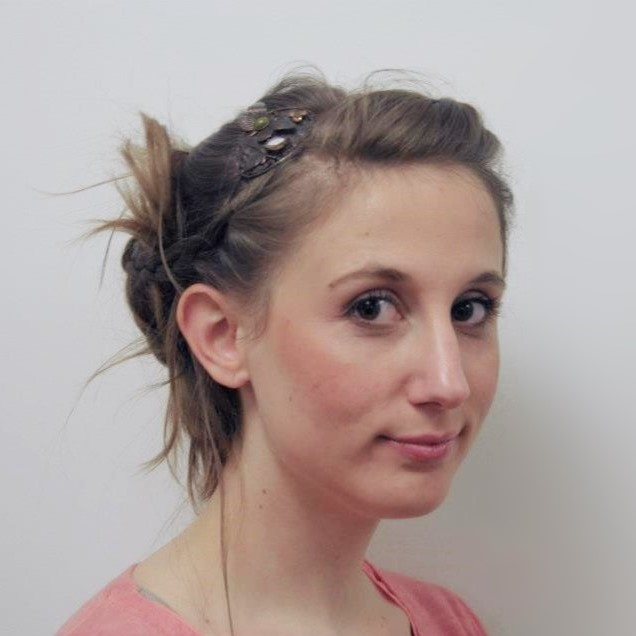
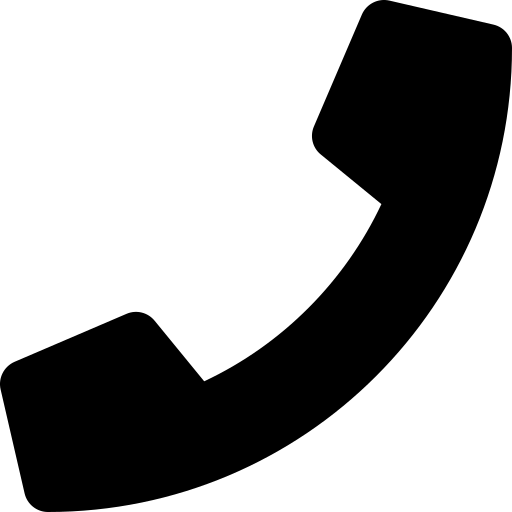
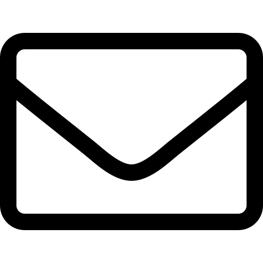

= Chargée de projet culturel
Léa Rumiz

[.info]
== !

=== Léa Rumiz

[contact]
-  06 98 60 15 36
-  lea.rumiz@gmail.com
- Permis B

=== !
[atouts]
* Gestion de projet
* Communication
* Médiation culturelle
* Anglais courant

==== Compétences complémentaires

- Photoshop, InDesign
- QuarkXPress
- Sphinx
- Bases HTML 5 / CSS 3
- WordPress

==== Qualités personnelles

- Rigueur
- Autonomie
- Esprit d'équipe
- Dynamisme

==== Centres d'intérêt

- Couture
- Littérature islandaise
- Pilates / Yoga

[.chronologie]
== !

=== Expérience professionnelle

==== 2015 - 2018 : Chargée de mission Métropole
*Festival Lumière* - Lyon (69)

- Coordonner les événements programmés dans plus de 20 communes de la Métropole.
- Faire le lien entre le festival et ses partenaires institutionnels et culturels.
- Assurer la visibilité des événements programmés
- Promouvoir le festival dans la presse locale en lien avec l'attachée de presse.
- Évaluer les retombées médiatiques et réaliser une revue de presse.
- Concevoir des outils de communication (programme, flyers, communiqués) avec l'équipe graphique.
- Rédiger du contenu de communication web et mettre en place un calendrier de diffusion.
- Accompagner des invités du festival (acteurs, réalisateurs, professionnels du cinéma).
- Traduire des interventions (anglais à français).
- Présenter des séances au public.
- Encadrer une personne en stage.

==== 2013 - 2014 : Responsable de la programmation culturelle
*Le Rize* - Ville de Villeurbanne (69)

- Définir la programmation culturelle.
- Organiser des événements (pièces de théâtre, conférences, concerts).
- Définir les moyens humains, matériels et financiers d'un projet.
- Rédiger des contrats.
- Accueillir les artistes et intervenants extérieurs.
- Coordonner des actions culturelles avec les autres services.
- Animer une réunion.

==== 2013 : Animatrice nature
*Direction Paysage et nature* - Ville de Villeurbanne (69)

- Concevoir des animations pédagogiques de vulgarisation scientifique (nature/environnement).
- Organiser la séance d'animation et préparer le matériel et l'espace d'animation.
- Animer des groupes jeune public et adultes.
- Guider les participants lors de la réalisation de l'activité  et l'adapter selon leurs besoins.
- Réaliser le bilan du projet d'animation et proposer des axes d'évolution.

=== Stages et projet professionnel

==== 2012 : Assistante programmation scientifique et culturelle
*Musée des Confluences* - Lyon (69)

- Réaliser une veille de la programmation de musées, en France et à l’étranger.
- Proposer des pistes de programmation par thématiques et publics cibles.

==== 2009 - 2010 : Chef de projet - valorisation d’un lieu patrimonial
*Grange du Clou* - Saint-Cyr sur Menthon (01)

- Concevoir et mettre en place une exposition d’art contemporain.
- Créer des outils de communication, de relations presse et de médiation culturelle.

==== 2009 : Médiatrice culturelle
*Fort du Bruissin*, Centre d’art contemporain - Francheville (69)

- Accompagner des groupes lors de visites guidées.
- Accueillir et informer le public.

==== 2009 : Chargée de communication
*Le Pavé Dans La Mare, Centre d’art contemporain* - Besançon (25)

- Créer des outils de communication et de relations presse.

=== Formation

==== 2012 : Master 2 Communication, Culture et Institutions
Sciences Po Lyon (69)

==== 2010 : Licence Médiation Culturelle
EAC, Formation supérieure aux métiers de la culture - Lyon (69)
